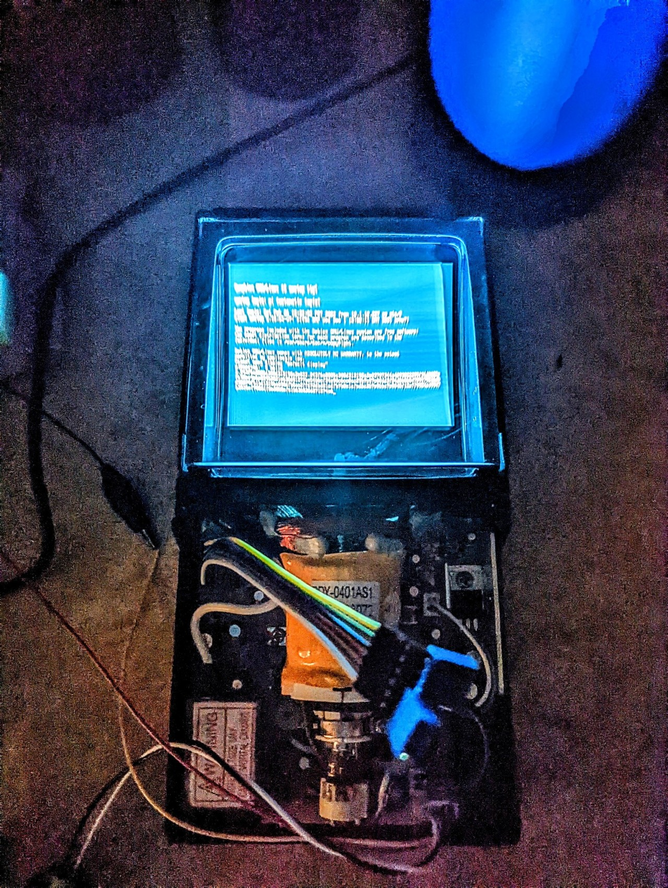
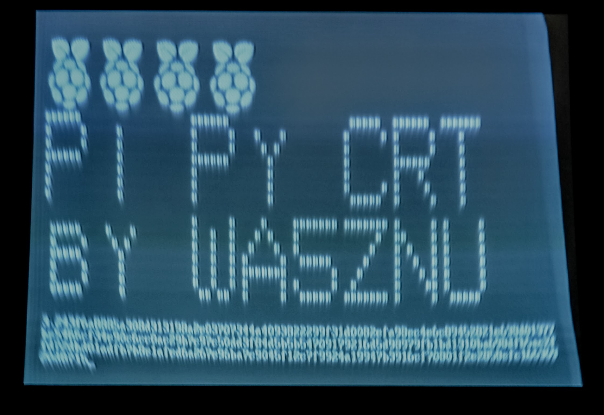

# Pi Py CRT

Prints Pi on a CRT, one hexadecimal digit at a time, with a Rasperry Pi and Python.

Pi in hex uses 
BBP algorithm implementation in Python from https://literateprograms.org/pi_with_the_bbp_formula__python_.html

## Sample Image

## Setup
- Edit kernel boot line settings to enable RCA output as described in references
- `raspi-config` for overscan/underscan, pixel doubling; used default size 720
- `sudo apt install mg python3 gmp-devel sysvbanner && pip install gmp`
- `mkdir -p ~/bin && cp play*.sh ~/bin/ && chmod a+x ~/bin/play*.sh`
- `export EDITOR=mg; crontab -e` `# add "@reboot /home/pi/bin/play.sh" to end`
- `sudo reboot`

# See Also
- See also the same idea using a Seeduino and Adafruit video library https://github.com/wa5znu/scavox-crt 

# References
- Banner http://unixgeeks.org/security/newbie/unix/man9/banner.html sysvbanner
- Analog Video Out https://mlagerberg.gitbooks.io/raspberry-pi/content/3.5-analog-video-output.html
- RPi Video Out (works fine on my 3B) https://raspberrypi.stackexchange.com/questions/69884/raspberry-pi-3-model-b-v1-2-connect-to-old-tv-via-composite-video-output
- More RPi Video Out https://magpi.raspberrypi.com/articles/rca-pi-zero
- More BBP https://www.experimentalmath.info/bbp-codes/
- More BBP https://en.wikipedia.org/wiki/Bailey%E2%80%93Borwein%E2%80%93Plouffe_formula
- Adafruit RPi video cable https://www.adafruit.com/product/2881
- RCA to pin adapter https://www.amazon.com/gp/product/B07FQ8RLQZ
- Sony CRT https://geeseang.wordpress.com/experiment-with-sony-flat-4inch-crt/
